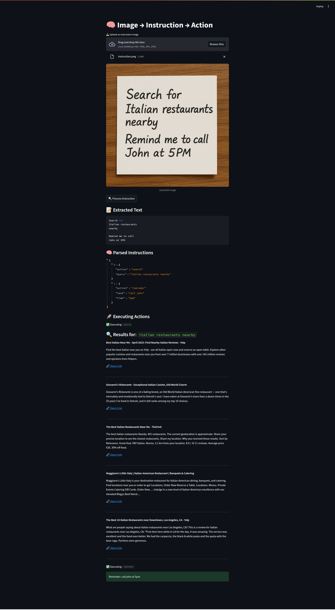

# 🧠 Image-to-Text + Text-to-Action Pipeline


> 📸 Turn handwritten or printed instructions into smart, automated actions — locally, offline, and 100% open-source.

---

## 🚀 Features

- 🔍 **OCR with Tesseract** — extract text from images
- 🧠 **NLP Intent Parsing** — understand instructions like “search”, “remind”, “note”
- 🌐 **DuckDuckGo-based Search** — real-time web results without an API key
- ⏰ **Local System Notifications** — set reminders using Ubuntu notifications
- 📥 **Streamlit UI** — upload images and execute actions with a click
- 🧱 **Modular Architecture** — easily extend with more action types

---

## 📸 Screenshot

  
*Drag an image → View text → Parsed intent → Instant execution*

---

## 💼 Real-World Use Cases

| Use Case               | What It Solves                                                                 |
|------------------------|---------------------------------------------------------------------------------|
| 👨‍⚕️ Smart Field Notes | Convert handwritten doctor/technician notes into actionable tasks              |
| 🧑‍🦯 Accessibility      | Assist visually impaired users with handwriting-based task execution            |
| 👩‍💼 Smart Assistant   | Turn whiteboard snapshots or sticky notes into reminders/searches              |
| 👨‍🏫 Student Helper    | Let students write a query and get results instantly                           |
| 🛰️ Offline Agent      | All functionality works **offline** — ideal for privacy and remote locations    |

---

## 🛠 Tech Stack

- **Python 3.8+**
- [Tesseract OCR](https://github.com/tesseract-ocr/tesseract)
- [spaCy](https://spacy.io/) for text parsing
- [duckduckgo-search](https://pypi.org/project/duckduckgo-search/) for web results
- Ubuntu system notifications (`notify-send`)
- [Streamlit](https://streamlit.io/) UI for interaction

---

## 📦 Setup Locally

```bash
# Clone repo
git clone https://github.com/yourusername/image-to-action
cd image-to-action

# Install dependencies
pip install -r requirements.txt

# Install Tesseract OCR and libnotify
sudo apt install tesseract-ocr libnotify-bin

# Launch the app
streamlit run streamlit_app.py
